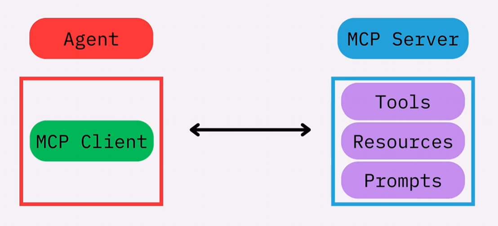

## Advanced Agent
### MCP (Model Context Protocol)
An open protocol that standardizes how your LLM applications connect to and work with your/others' tools and data sources. Think it as a USB cable, that can connect any speakers or mics or any other devices to your computer.

There's a huge open source community of MCP servers that other people have built which we can easily insert into our agent and other types of AI applications.
- Transport Mechanisms ([Official Documents](https://modelcontextprotocol.io/docs/learn/architecture))
    - stdio: communicatation over standard in and standard out
    - streamable_http
### Context and State
### Multi-Agent Systems
