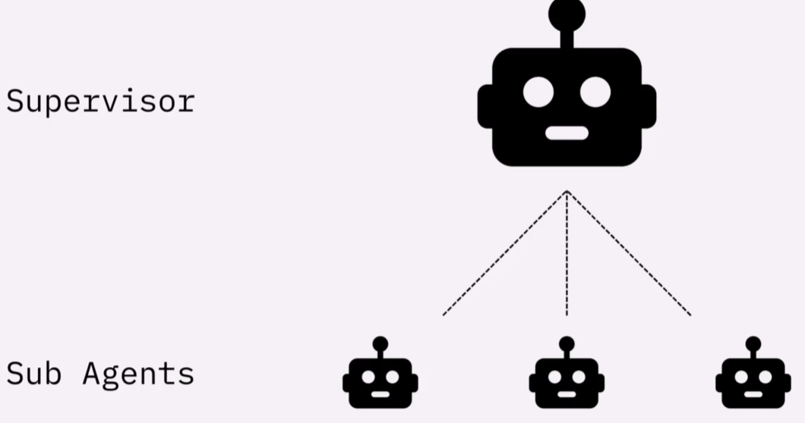

## Advanced Agent
### MCP (Model Context Protocol)
An open protocol that standardizes how your LLM applications connect to and work with your/others' tools and data sources. Think it as a USB cable, that can connect any speakers or mics or any other devices to your computer.

There's a huge open source community of MCP servers that other people have built which we can easily insert into our agent and other types of AI applications.
- Transport Mechanisms ([Official Documents](https://modelcontextprotocol.io/docs/learn/architecture))
    - stdio: communicatation over standard in and standard out
    - streamable_http
### [Context](https://docs.langchain.com/oss/python/langchain/context-engineering#state-3) and State
- Differences between context_schema, system prompt and RAG system:
    - Context Schema:
        - A context schema is a structured runtime state outside the LLM, it is a **system state**, not knowledge.
        - It is deterministic, structured and hidden from the model.
        - It is server-side session variables (backend session object), It is useful for business logic, e.g. permissions, config, IDs.
    - System Prompt:
        - Inside the prompt sent to the LLM, intended for model reasoning and instructions.
        - It is unstructured, soft gudiance (LLM may forget / ignore), prone to interpretation / hallucination.
        - It is not useful for business logic, only for prompting style.
    - RAG system:
        - It is external knowledge that the LLM can read and reason over, RAG content goes into the prompt.
        - It is textual, unstructured, visible to LLM.
        - It is searchable knowledge base.
- Create Context Schema:
Use @dataclass to create your context schema. It is a clean way to define structured data without writing an __init__. While it is mandatory to use @dataclass for context schema, you could also use a plain class or even a dict.
```python 
@dataclass
class ColorContext:
    fav_color: str = "blue"
    least_fav_color: str = "black"
```
- Access Context Schema
The context isn't passed to the model directly. Instead, it's passed to an object called **tool runtime**, which contains the information that the model has access to. **Note:** "runtime: ToolRuntime" here is not just a type hint, it is actively inspected and used in at runtime.
```python
@tool
def function(runtime: ToolRuntime) -> str:
    return runtime.context.xxx
```

### Multi-Agent Systems
To break down the complex application into multiple specialized agents that work together to solve the problem, rather than a singular agent to handle every step.  
- Supervisor sub-agent model
    