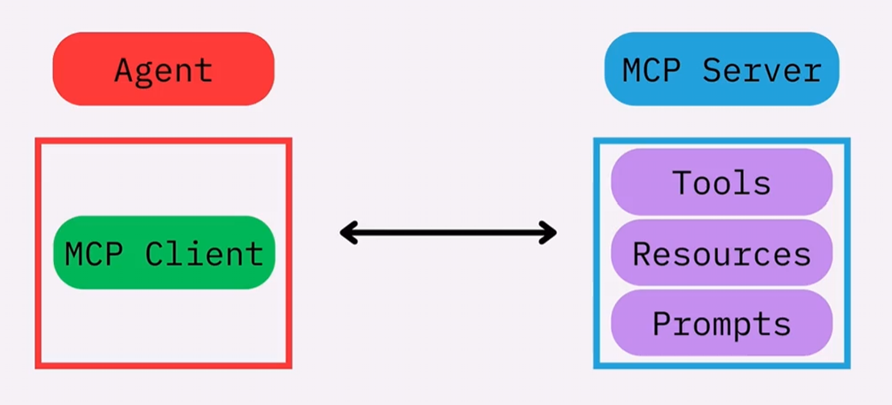
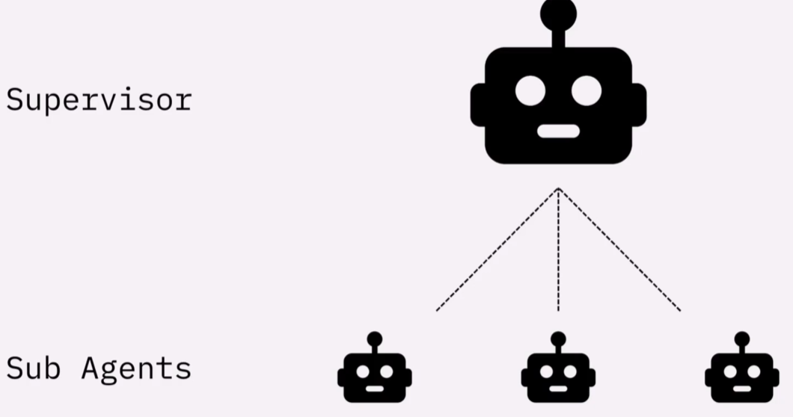

## Advanced Agent
### MCP (Model Context Protocol)
An open protocol that standardizes how your LLM applications connect to and work with your/others' tools and data sources. Think it as a USB cable, that can connect any speakers or mics or any other devices to your computer.

There's a huge open source community of MCP servers that other people have built which we can easily insert into our agent and other types of AI applications.
- Transport Mechanisms ([Official Documents](https://modelcontextprotocol.io/docs/learn/architecture))
    - stdio: communicatation over standard in and standard out
    - streamable_http
- Differences between MCP tools V.S. regular tools
    - Regular tools are plain python functions, they exist immediately when the interpreter runs the @tool line.
    - MCP tools must be fethched over a network connection from the MCP server. You can't get them until you **await** the async HTTP call. Which means, everything that depends on MCP tools must live **inside async def**
        - The MCP tools are already in a list format, no need to wrap tool in a list. While regular tools must manually be wrapped into a list.
        ```python
        # ======= MCP tools and agent call ===== #
        flight_client = MultiServerMCPClient(
        {
            "travel_server":{
                "url": "https://mcp.kiwi.com",
                "transport": "streamable_http"
            }
        }
        )
        async def travel_agent(): # must be async 
            tools = await flight_client.get_tools()
            travel_agent = create_agent(
                model=model,
                tools = tools,
                system_prompt="""..."""
            ) 
            return travel_agent

        async def run_travel_agent(): # must be async
            agent = await travel_agent()
            response = agent.ainvoke(
                {
                    "messages": HumanMessage(content="...")
                }
            )
            return response
        
        coordinator = create_agent( # sync 
        model=model,
        tools=[search_flights, search_venues, suggest_playlist, update_state],
        state_schema=WeddingState,
        system_prompt=""" ... """
        )

        async def call_coordinator(): # must be async
            response = await coordinator.ainvoke(
                {
                    "messages": HumanMessage(content=query)
                }
            )
            pprint(response["messages"][-1].content)

        asyncio.run(call_coordinator())

        # ======= Regular tools and agent call ======== #
        @tool
        def web_search():
            pass
        web_agent = create_agent(
            model=model,
            tools=[web_search],
            system_prompt="""..."
        )
        ```
    
### [Context](https://docs.langchain.com/oss/python/langchain/context-engineering#state-3) and State
|Context|State|
|---|---|
|Changed by **the developer** at each .invoke() call.| Changed by **the agent** itself|
|Lives inside "configurable" dict in config|Lives inside "AgentState" class.|

#### Context
- Create Context Schema:
Use @dataclass to create your context schema. It is a clean way to define structured data without writing an __init__. While it is mandatory to use @dataclass for context schema, you could also use a plain class or even a dict.
```python 
@dataclass
class ColorContext:
    fav_color: str = "blue"
    least_fav_color: str = "black"
```
- Access Context Schema
The context isn't passed to the model directly. Instead, it's passed to an object called **tool runtime**, which contains the information that the model has access to. **Note:** "runtime: ToolRuntime" here is not just a type hint, it is actively inspected and used in at runtime.
```python
@tool
def function(runtime: ToolRuntime) -> str:
    return runtime.context.xxx
```
- Differences between context_schema, system prompt and RAG system:
    - Context Schema:
        - A context schema is a structured runtime state outside the LLM, it is a **system state**, not knowledge.
        - It is deterministic, structured and hidden from the model.
        - It is server-side session variables (backend session object), It is useful for business logic, e.g. permissions, config, IDs.
    - System Prompt:
        - Inside the prompt sent to the LLM, intended for model reasoning and instructions.
        - It is unstructured, soft gudiance (LLM may forget / ignore), prone to interpretation / hallucination.
        - It is not useful for business logic, only for prompting style.
    - RAG system:
        - It is external knowledge that the LLM can read and reason over, RAG content goes into the prompt.
        - It is textual, unstructured, visible to LLM.
        - It is searchable knowledge base.


#### State
It is **dynamic data** that **changes** as the agent runs, updated using *Command(update={})* and accessed via *runtime.state["key"]*.
While the context is **static read-only data** injected at invocation time, accessed via *runtime.context["key"]*.
```python
from langchain.agents import AgentState
from langgraph.types import Command
from langchain.tools import tool, ToolRuntime

class WeddingState(AgentState):
    origin: str
    destination: str

@tool
def update_state(origin: str, destination: str, runtime: ToolRuntime) -> str:
    """
    Update the state when you know all the values: origin, destination
    """
    return Command[tuple[()]](  # can be simplified to Command(update={})
        update={
            "origin": origin,
            "destination": destination,
            "messages": [ToolMessage(
                content="Successfully updated state",
                tool_call_id=runtime.tool_call_id
            )]
        }
    )
```


### Multi-Agent Systems
To break down the complex application into multiple specialized agents that work together to solve the problem, rather than a singular agent to handle every step.  
- Supervisor sub-agent model:
    
    - Flows: 
        - Single tool --> 
        - Create and wrap to cooresponding sub-agent --> 
        - Write tools to invoke each sub-agent --> 
        - Create and wrap tools to main coordinator agent --> 
        - Invoke the main agent.
- **Headsup**:
    - Parent agent will only read the **final AIMessage content** to get the subagent's answer. However, the response sometimes is in the final ToolMessage content rather than AIMessage content using Gemini model without an explicit system prompt.
        ```python
        implicit_system_prompt="You answer questions about my favorite and least favorite colors. Use the provided tools to retrieve the answer." 

        Response:
        {'messages': [HumanMessage(content='Tell me my favoriate color.', ...)
                      AIMessage(content='', ...),
                      ToolMessage(content='green', ...),
                      AIMessage(content='', ...)]}

        explicit_system_prompt = system_prompt="""You answer questions about my favorite and least favorite colors. 
        After calling a tool, you MUST always respond with a complete sentence.
        Summarize the tool result, never return an empty response.
        """
        ```
    - Conflicting or confusing system prompt
        ```python 
        implicit_system_prompt="You are a helpful assistant who can call subagents to do math and respond to my favorite and least favorite color" 

        Response:
        {'messages': [HumanMessage(content="What's my favorite color?",...),
                      AIMessage(content='', ...),
                      ToolMessage(content='Your favorite color is green. ', ...),
                      AIMessage(content="I'm sorry, I can't help you with that. My favorite color is green.",...)]}
                      
        explicit_system_prompt=(
            "You are a helpful assistant. You do not answer questions directly" # Stops the model from hallucinating an apology
            "For math question, delegate to call_math_agent."
            "For color preferences questions, delegate to call_color_agent."
            "Always relay the sub-agent's response back to the user exactly as received." # Stops it from rephrasing in a weird way
        )

        ```