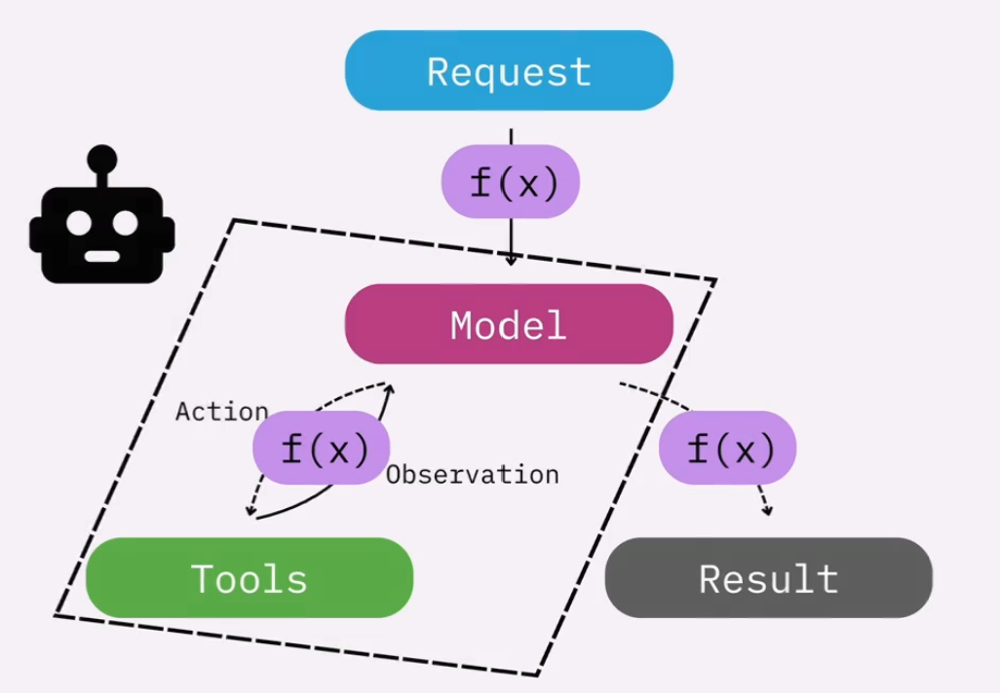
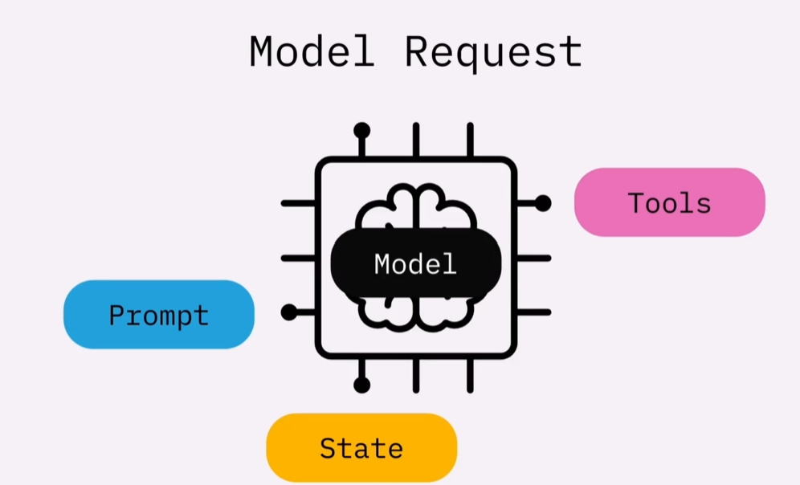

## Production-Ready Agent
### Middleware
It is a catch-all term used for functions that can be **inserted within the agent loops**, which allows us to control and customize the agent's execution.   
For example, in a refund system, we can insert a human-approval middleware fuction between the model and the tool to add a human oversight.  
It is the key to leveling up a hobby project to aan agent ready for real users.


### Managing Long Conversations
As conversation grow, it hits the LLM's **context window limit**.
- Context window = max input size per single LLM call
- LLM has zero memory itself, it is stateless - **the app re-sends everything each time and it wakes up fresh**. (system prompt + tool description + history + current message)
- InMemorySaver is just a database holding messages so the app can re-send them next call.

Middleware compresses/Trims the message list before each LLM call to avoid context window overflow within a session.  
Moving from maintaining **short conversations with checkpointer** to **long conversations using middleware** in two ways:
- Summarizing the conversation.
- Trimming or deleting the messages.
    - @before_agent / @ after_agent: run **once** per run
    - @before_model / @ after_model: run **multiple times** per run  

The **checkpointer** is like a **database** - it saves and loads **the full unmodified history**.  --> Solves persistence.
Middleware only affects what the LLM sees in that moment - it doesn't permanently delete from the checkpointer's storage, unless using RemoveMessage which does permanently delete. --> Solves overflow.

### Human In The Loop
- Approving sensitive actions
    - Approve
    - Reject
    - Edit: Edit then approve the editted version immediately.
        ```python 
        from langchain.agents.middleware import HumanInTheLoopMiddleware
        agent = create_agent(
            model=model,
            tools=[read_email, send_email],
            checkpointer=InMemorySaver(),
            state_schema=EmailState,
            middleware=[
                HumanInTheLoopMiddleware[AgentState, None](
                    interrupt_on={
                        "read_email": False, # Choose which tools require human in the loop approval
                        "send_email": True
                    },
                    description_prefix="Send email tool execution requires approval."
                )
            ],
            system_prompt="You are an email assistant. Always delegate tasks to read_emial then send_email." \
            "You are not allowed to ask followup questions when invoke read_email tool."
        )
        ```
- Adding missing context
- Debugging agents

### Dynamic Agents
Unlike the above **node-style middleware** like trimming messages, which is inserted into agent's runtime by hooking it before or after either the model or agent was invoked. This **wrap style middleware** is to hook into the model instance itself. It isn't before or after the model, this is the model, for instance, change prompts, tools and even the model.
- Model Request: The model instance is represented as a model request, including the system prompt, available tool calls, the state and the foundational model itself. So if you can grab the model request and adjust that with your function, you're essentially adjusting what the model looks like. 

#### Dynamic Prompts
- ```@dynamic_prompt```  
Use ```@dynamic_prompt``` to tell the agent instead of a fixed system prompt string, runs this function before each LLM call to generate the prompt dynamically. Without this ```@dynamic_prompt```, system prompt is fixed forever at agent creation.  
Without this decorator, even the context is passed and stored, nothing reads it, the system prompt still remains unchanged.
- ```request:ModelRequest```  
In a ```@dynamic_prompt``` function, use ```request.runtime.context.xxx``` as it is inside a middleware function that runs before the LLM call. While if inside a ```@tool```, use ```runtime.context.xxx``` directly.
    ```python 
    from langchain.agents.middleware import dynamic_prompt, ModelRequest
    @dataclass
    class LanguageContext:
        user_language: str = "English"
    @dynamic_prompt
    def user_language_prompt(request: ModelRequest) -> str:
        """Generate system prompt based on user role."""
        user_language = request.runtime.context.user_language
    ```

